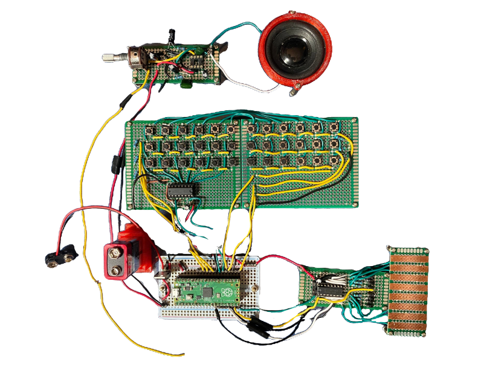

# Picochord
An open source digital Omnichord clone based on the Raspberry Pi Pico. The firmware is currently configured to only generate audio from the input signals, but usb/analog midi support is in the works for the near future.

## Building the Firmware
The getting started guide has detailed instructions for building on each OS. https://datasheets.raspberrypi.com/pico/getting-started-with-pico.pdf

You will likely have to cd into the build directory to configure cmake and build.

## Circuits
The entire Picochord is comprised of three main subcircuits, all driven by the pico. 

* Keypad
* Strumpad
* Speaker amplifier

The PCB directory contains simulations, schematics, PCB's and screenshots for each of the circuits. The schematics/PCBs can be viewed with KiCad 6.0

## Chassis
The PCB's were screwed directly into a acrylic board. The only other required pieces were a battery holder and speaker holder which I have included STL's and FreeCad files for. 